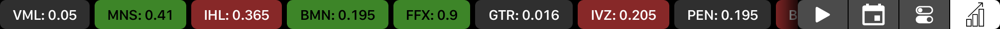
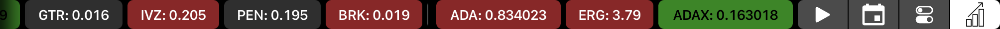
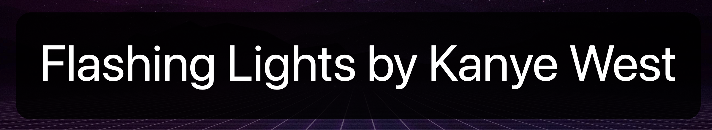

# ¿Qué es esto
- what is this?
- these are my presets for **bettertouchtools**, an application which enables control of the touchbar and touchpad on MacBooks

# Aquatouch

The aquatouch preset is mostly just a slightly modified version of yuuiko's [aquatouch](https://github.com/yuuiko/AquaTouch)

Here are a couple screenshots:

# Triggers+settings

The triggers & settings file contains my own touchpad commands and are:
- 1 finger tap bottom left
	- plays / pauses music that is running on my raspberry pi through mpd
- 1 finger tap top left
	- displays the song which is playing through mpd as a banner
- 1 finger tap bottom right
	- lowers brightness
- 1 finger tap bottom right
	- increases brightness
- 2 finger swipe in from right
	- previous track (through mpd)
- 2 finger swipe in from left
	- next track
- 2 finger swipe in from top
	- decrease volume
- 2 finger swipe in from bottom
	- increase volume
- 2 finger force touch
	- open link under cursor in new tab
- 3 finger force touch
	- close tab
- 4 finger fource touch
	- reopen recently closed tab
- 15&deg; clockwise rotation (with 2 fingers, like rotating a picture)
	- next tab
	- in tmux, switches to next window
- 15&deg; anti-clockwise rotation (as above)
	- previous tab
	- in tmux, switches to previous window

It is rather difficult to take screenshots of this part of the workflow, but here is the preview I get after tapping the top left of the touchpad.

